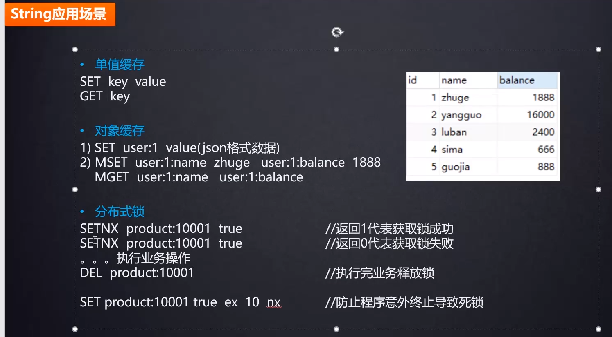

**安装**

<https://redis.io/> 


```
tar -zxvf redis-5.0.6

cd ...

 make PREFIX=/opt/redis5.0.6 install


修改配置文件
vi [redis-xxx]/7001/redis.conf 
    bind 127.0.0.1 x.x.x.x #添加ip，或者注释掉即谁都能访问
    port 7001  #修改端口对应
    requirepass redis6380 配置密码!!
    daemonize yes

    cluster-enabled yes
    cluster-config-file nodes.conf 
    cluster-node-timeout 5000
    appendonly yes
    
    

后台启动
cp /usr/local/redis-5.0.6/redis.conf  /opt/redis5.0.6/bin
cd ...
vi redis.conf
	daemonize yes

启动server/关闭
./redis-server ./redis.conf
kill ... / pkill redis-server

启动客户端/关闭客户端
./redis-cli 
./redis-cli shutdown
```


学习重点：Redis各种存储类型 分布式锁

String




