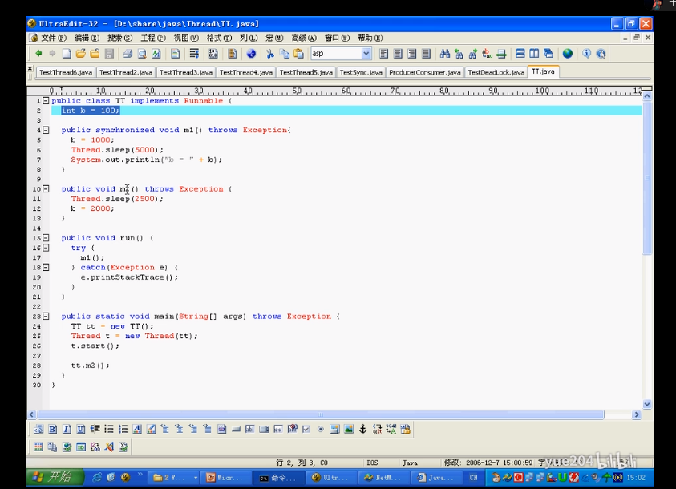

**第一个方法加锁，第二个方法不加锁	两个方法都加锁，自己实验证实清楚**




**wait 马士兵139 说生产者消费者**


lock and unlock

```
public TaskItem getNextTaskItem(Worker worker) {
		ReentrantLock waitingAndStop = EngineUtil.getWaitingAndStopLock();
		try {
			waitingAndStop.lock();
			List<String> users = resourceManager.getUsers(taskResourceLimit);
			UserTaskQueue userTaskQueue = userTaskQueues.getLonggestQueue(users);
			if (userTaskQueue == null)
				return null;
			if (resourceManager.isSystemResourceEnough(taskResourceLimit)) {
				TaskItem taskItem = userTaskQueue.getTaskItem();
				Logger.getLogger(Engine.class).info("user resource limit is" + resourceManager.getUserResource(taskItem.userId).resource.getCPUNums() + ":" +
				resourceManager.getUserResource(taskItem.userId).resource.getMemorys());
				resourceManager.assignResource2User(taskItem.userId, taskItem.resourceLimit);
				taskManager.configJob(taskItem, worker);
				return taskItem;
			}
		} finally {
			waitingAndStop.unlock();
		}
		return null;
	}
	
```


**数据库中的锁和程序中的锁概念是不一样的**


**JAVA 中的锁**

```

新版本的java 锁  偏向锁 --> 轻锁--> 重锁  

悲观锁 ： 总是假设最坏的情况，每次取数据时都认为其他线程会修改，所以都会加（悲观）锁。一旦加锁，不同线程同时执行时,只能有一个线程执行，其他的线程在入口处等待，直到锁被释放。 

乐观锁：乐观锁顾名思义就是在操作时很乐观，认为操作不会产生并发问题(不会有其他线程对数据进行修改)，因此不会上锁。但是在 更新 时会判断其他线程在这之前有没有对数据进行修改，一般会使用版本号机制或CAS(compare and swap)算法实现。 

读的多，冲突几率小，乐观锁。

写的多，冲突几率大，悲观锁。


互斥锁 ：如果事务T对数据A加上排他锁后，则其他事务不能再对A加任任何类型的锁，直到在事务的末尾将资源上的锁释放为止。获准排他锁的事务既能读数据，又能修改数据。   

共享锁：如果事务T对数据A加上共享锁后，则其他事务只能对A再加共享锁，不能加排他锁（互斥锁），直到已释放所有共享锁。获准共享锁的事务只能读数据，不能修改数据。 

aqs 锁的一个框架，实现tryAcquire 和tryRelease（在quire中被调用），  调用是电泳 quire，其实想了双向排队的逻辑，也叫CLH（三个人名）队列。 原子操作 ，新版本的cpu 都指出aqs

 volatile 禁止jvm优化， 不用jvm并发 不用占用自己的内存，弄完就写回去

```

