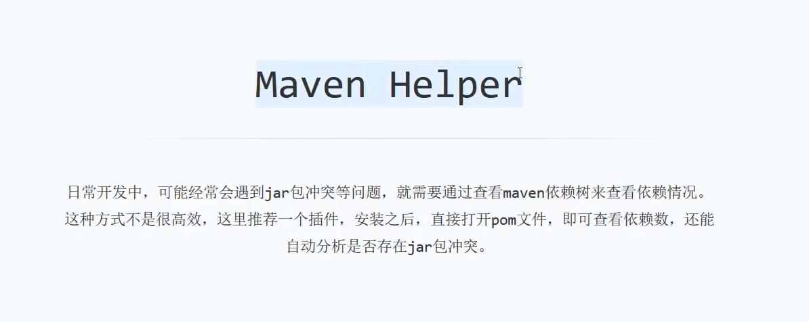
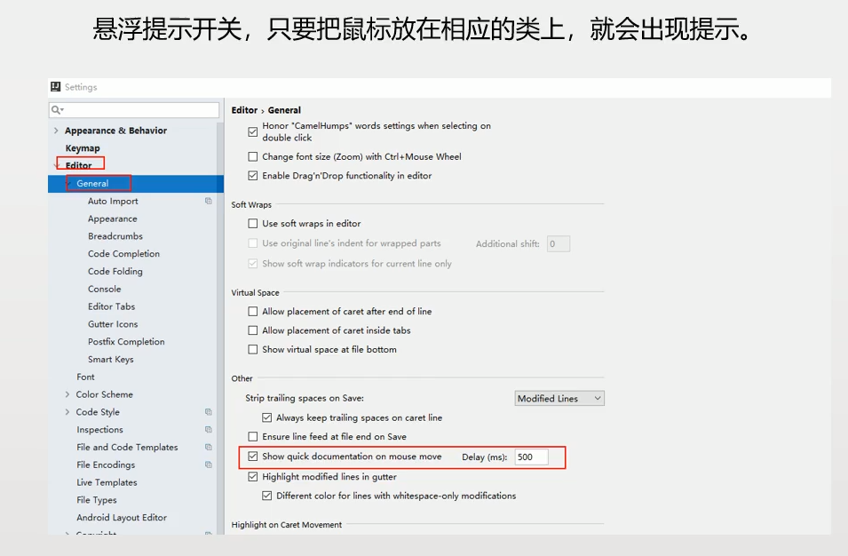
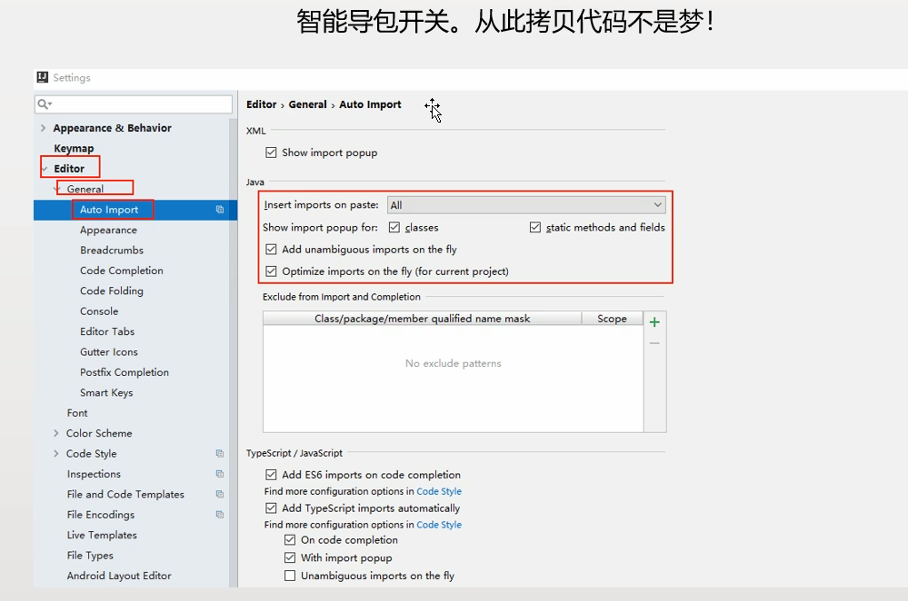

**好记星**

```
快速查看可重写父类方法
Ctrl+o 

快速对象中有那些方法
Ctrl+F12

整理引入的包
Ctrl+ shift + 0 


```

---------------------------------

## 插件




mybatis逆向工程


-----------------------------------

## 快捷键

呼出git控制台







去掉智能打印SQL (没有作用)


idea中热部署


