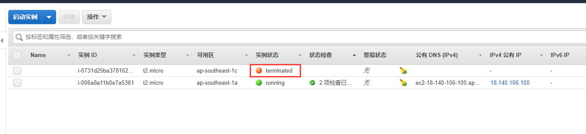

0.需要一个双币信用卡 ， 网上就能申请，邮寄到家（浦发）

1.注册

1.1前往亚马逊<http://aws.amazon.com/cn/>  注册。中文，自己根据里面的资料慢慢填写即可。填写过程中必须要绑定信用卡，会有一个1美金的预授权，扣费后，会退还。（我当时注册的时候2个小时不到就退还了，现在的政策好像是1年后，因为我只能注册一个账户，没法给各位再次验证。所以各位注册的时候留意下自己的信用卡，看1美金扣费是多久退回）

1.2提醒一：手机验证，注册的时候需要输入手机号，会有验证码什么的，大家记得用真实的信息即可。

1.3提醒二：信用卡账单，在国外信用卡付费是不需要密码的，也就是根据你的信用卡正反面信息即可直接在网络上操作扣费（一般扣费都可以申请追回，之前李小姐的精算师会员费在不知道的情况下扣费，一封邮件过去就追回了，好几百刀），自己的信用卡自己保护好。亚马逊当然不会恶意扣费，只是免费套餐限制多，超出部分是要扣费的。具体下面会讲。

2.创建


选免费的，本文使用的系统为 Ubuntu Server 18.04  


全都选免费的，其他启动后再配置。秘钥 一定要下载到本地， 丢失 删了重建把


安全组


本地可以ping通此ip 继续


3.连接

工具——用户密匙管理者——导入——选择对应的密匙（下载的yourname.pem文件） 


关闭继续


登录


改用root

sudo -s

4.安装 Shadowsocks 

```
sudo apt-get install python3-pip

apt-get install python-pip python-gevent python-m2crypto
pip install --upgrade setuptools

pip install shadowsocks
出现Successfully installed shadowsocks-XXX说明安装成功了

mkdir /etc/shadowsocks
vim /etc/shadowsocks/config.json
{
        "server":"0.0.0.0",
        "server_port": 58388,
        "local_address": "127.0.0.1",
        "password":"sayworld",
        "timeout":600,
        "method":"aes-256-cfb",
        "fast_open": false
}


启动
ssserver -c /etc/shadowsocks/config.json -d start

错误：
undefined symbol: EVP_CIPHER_CTX_cleanup
解决：
vim /usr/local/lib/python2.7/dist-packages/shadowsocks/crypto/openssl.py
替换文中libcrypto.EVP_CIPHER_CTX_cleanup.argtypes 为libcrypto.EVP_CIPHER_CTX_reset.argtypes

启动
ssserver -c /etc/shadowsocks/config.json -d start

停止
ssserver -c /etc/shadowsocks/config.json -d stop

查看启动端口
netstat -lntup
```


5.下载**shadowsocks-windows**

<https://github.com/shadowsocks/shadowsocks-windows/releases> 


一定要启动


6.彻底删除ec2




Terminate实例之后，转到volume那里，每个volume有和实例（instance）的link, 可以查看一下是否是正在使用的还是是已经stop或者terminate的实例, 先detach volume, 分离实例和卷。 然后在Action上选择delete volume 彻底删除卷。 

删除卷之后，terminate掉的实例会自动被系统清除，无需手动清除，但需要等一段时间。 

