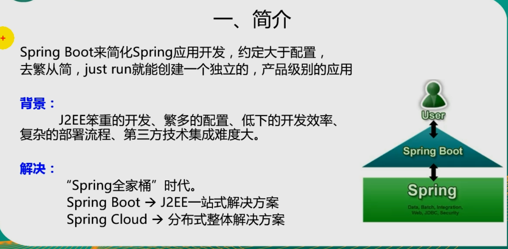
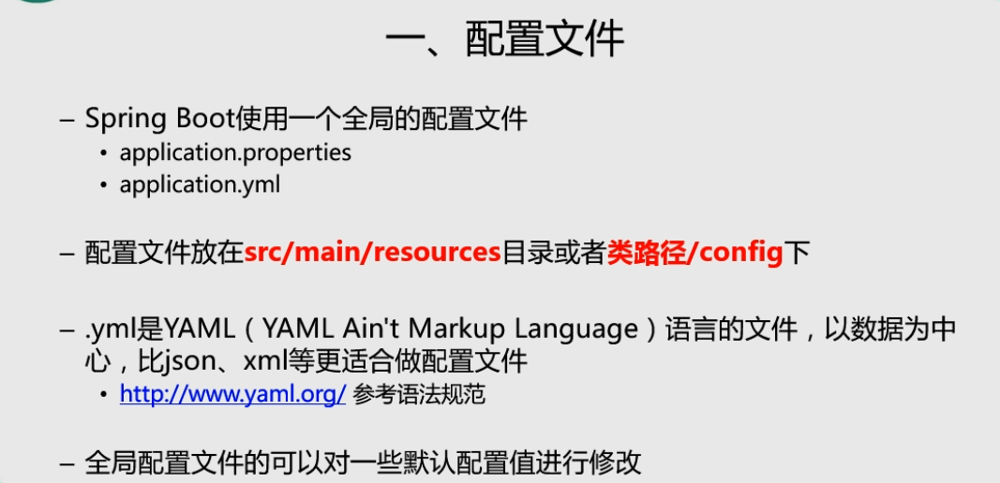
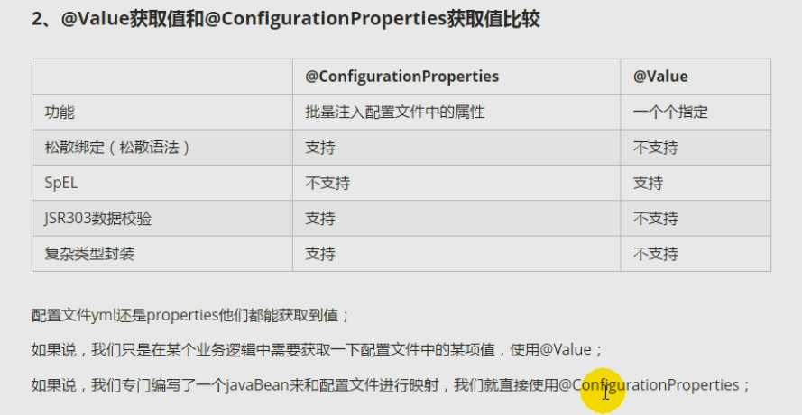
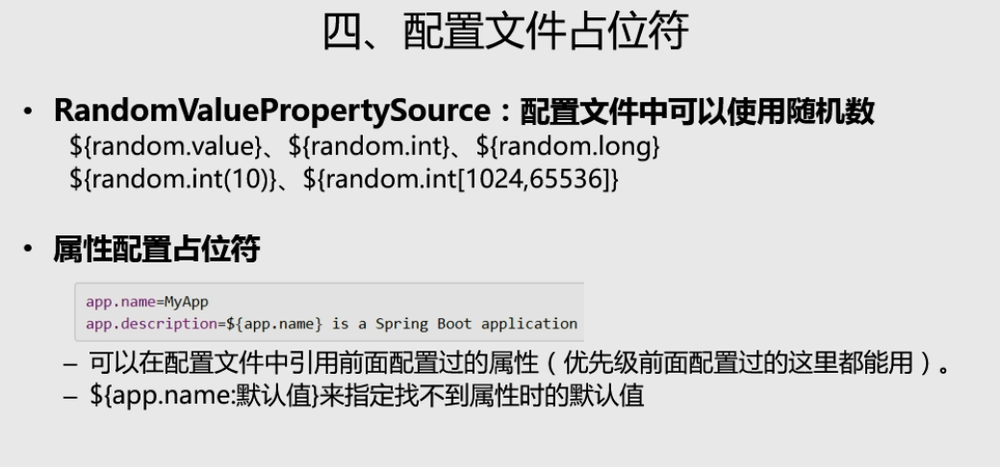
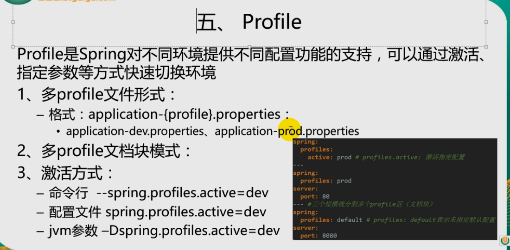
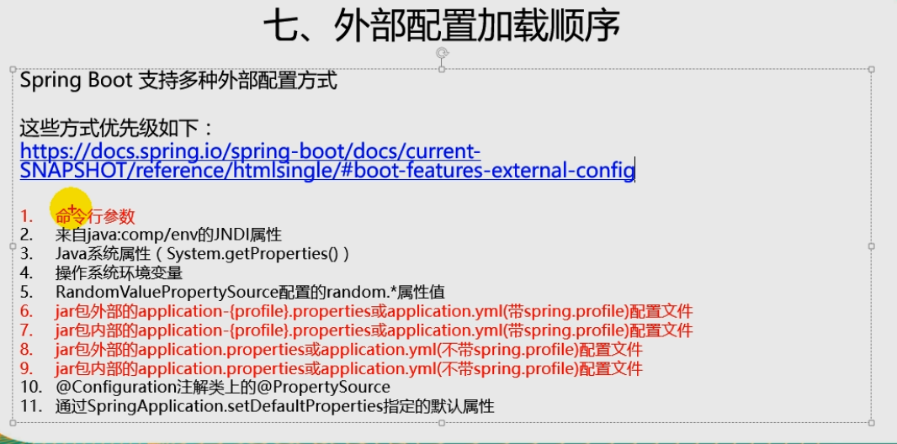
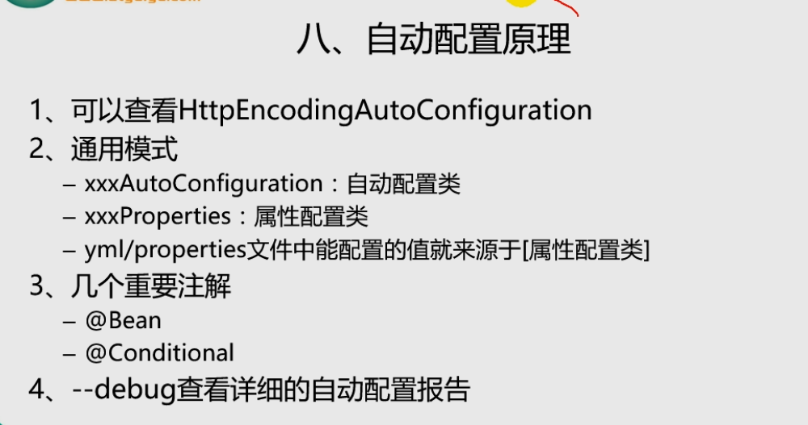

**小知识**

```
@GetMapping 后面不写路径，先找GetMapping，再找RequestMapping
如果出现多个不写的，编译会报错 org.springframework.beans.factory.BeanCreationException

异常扔出，下面就会停止

@RequestMapping("indexF/{id1}/{name}")	
@RequestMapping("indexF/{id1}") 	可以共存，赋值方式严格按照名称，有就是有，没有就是没有

@PathVariable
@RequestMapping 		存在与否无所谓，给变量起了个别名而已，有责为必须参数

@RequestParam(name = "name",defaultValue = "lg" ,required = true)
有defaultValue，再有required = true 是没有效果的，因为有默认值


```


**状态码**

```
200 OK - [GET]：服务器成功返回用户请求的数据，该操作是幂等的（Idempotent）。
201 CREATED - [POST/PUT/PATCH]：用户新建或修改数据成功。
202 Accepted - [*]：表示一个请求已经进入后台排队（异步任务）
204 NO CONTENT - [DELETE]：用户删除数据成功。
400 INVALID REQUEST-[POST/PUT/PATCH]：用户发出的请求有错误，服务器没有进行新建或修改数据的操作
401 Unauthorized - [*]：表示用户没有权限（令牌、用户名、密码错误）。
403 Forbidden - [*] 表示用户得到授权（与401错误相对），但是访问是被禁止的。
404 NOT FOUND - [*]：用户发出的请求针对的是不存在的记录，服务器没有进行操作，该操作是幂等的。
406 Not Acceptable - [GET]：用户请求的格式不可得（比如用户请求JSON格式，但是只有XML格式）。
410 Gone -[GET]：用户请求的资源被永久删除，且不会再得到的。
422 Unprocesable entity - [POST/PUT/PATCH] 当创建一个对象时，发生一个验证错误。
500 INTERNAL SERVER ERROR - [*]：服务器发生错误，用户将无法判断发出的请求是否成功。
详细：https://www.w3.org/Protocols/rfc2616/rfc2616-sec10.html
```


**创建工程**

```
idea创建一个工程

new module

maven

引入依赖 太长，在下面
```


**注解**

```
扫描同级包和子包
@SpringBootApplication   相比于@EnableAutoConfiguration方法，这个比较实用


表是该类下的方法 返回都是json格式的
@RestController	 = @Controller + @ResponseBody  后者用的多，因为还要跳转页面

基础的四类里面，只有GetMapping 不能穿json,但也只有get都能传常参
@PostMapping("/requestParam")
@GetMapping("/requestParam")
@PubMapping("/requestParam")
@DeleteMapping("/requestParam")

http://localhost:8080/requestParam?name=nn		//请求样例
@GetMapping("/requestParam")		
@RequestParam

http://localhost:8080/pathVariable/nam			//请求样例
@GetMapping("/pathVariable/{name}")
@PathVariable
//url/{name}/**		
//的到后面的参数
//String relativePath = HttpHelper.extractPathFromPattern(request);

@RequestBody		json格式

@RequestPart		文件对象

//Configuration和Component通用 但下面的组合更流行
@Configuration
@Bean

@Component


事务
@Transactional

方法已过时，但可以用
@Deprecated			

捕获异常
@ControllerAdvice
@ExceptionHandler
日志，邮件发送给程序员


--------------------------------------------------------------------------------------------------
自动扫描当前类
@EnableAutoConfiguration


扫包的范围
@ComponetScan(basePackages = {... , ...})


请求地址
@RequestMapping()


客户端用POST请求 可以刷新配置内容
@RefreshScope

//方法返回类型
@Produces("application/json")		

http://localhost:8080/requestParam?name=nn
@QueryParam("name")

http://localhost:8080/pathVariable/nam	
@PathParam("name")

//当有两个实现类的时候，优先选择这个
@Primary

//当有两个实现类的时候，可加上这个注解来区分	
@Qualifier("opreaSinger")
@Qualifier("metalSinger")

//读取配置文件name，a 都是${Dbname}的值
 @Value("${Dbname}")
 public void setUsersss(String name,String a) {
     String ab = a+"as";
     this.user = name;
 }
 
 //指定扫包范围 而 @SpringBootApplication全都搜
@Component
@ComponentScan(basePackages = "geovis.services.*")

 //指定扫包范围
@EntityScan

@Entity
@Table(name = "grade")
table(){}

//该注解不是必须的，如果一个接口符合"函数式接口"定义，那么加不加该注解都没有影响
@FunctionalInterface	


@NoArgsConstructor
@AllArgsConstructor

@JsonIgnoreProperties(value = {"hibernateLazyInitializer", "handler", "fieldHandler"})

@Cacheable(value = "newQuery", key = "'exist'+#code")

@CacheEvict(value = "newQuery", allEntries = true)

//统一配置本类的缓存注解的属性
@CacheConfig
table(){}


```


**java 精妙语法**

```
String.format("  \"Level\" = %s ", level)

String.join(" And ", Wheres)

String.format(insertSql, newmaxId,input.Name,input.Lon,input.Lat,code)

values.forEach((k, v) -> {
    if (v != null && v.toString().startsWith("ST_"))
    	list.add(String.format(" \"%s\" = %s ", k, v));
    else
        list.add(String.format(" \"%s\" = '%s' ", k, v));
});

```


**pom**

```
<?xml version="1.0" encoding="UTF-8"?>
<project xmlns="http://maven.apache.org/POM/4.0.0"
         xmlns:xsi="http://www.w3.org/2001/XMLSchema-instance"
         xsi:schemaLocation="http://maven.apache.org/POM/4.0.0 http://maven.apache.org/xsd/maven-4.0.0.xsd">
    <modelVersion>4.0.0</modelVersion>

    <groupId>lg</groupId>
    <artifactId>SpringData</artifactId>
    <version>1.0-SNAPSHOT</version>

    <parent>
        <groupId>org.springframework.boot</groupId>
        <artifactId>spring-boot-starter-parent</artifactId>
        <version>2.1.7.RELEASE</version>
        <relativePath/> <!-- lookup parent from repository -->
    </parent>

    <properties>
        <java.version>1.8</java.version>
    </properties>

    <dependencies>

        <!--Spring boot  start-->
       <dependency>
            <groupId>org.springframework.boot</groupId>
            <artifactId>spring-boot-starter</artifactId>
        </dependency>

        <dependency>
            <groupId>org.springframework.boot</groupId>
            <artifactId>spring-boot-starter-test</artifactId>
            <scope>test</scope>
        </dependency>


        <!-- web 支持 1. web mvc  2. restful 3. jackson 4. aop .....-->
        <dependency>
            <groupId>org.springframework.boot</groupId>
            <artifactId>spring-boot-starter-web</artifactId>
            <!-- 从依赖信息里移除 Tomcat配置 -->
            <exclusions>
                <exclusion>
                    <groupId>org.springframework.boot</groupId>
                    <artifactId>spring-boot-starter-tomcat</artifactId>
                </exclusion>
            </exclusions>
        </dependency>

        <!--undertow 容器代替 tomcat-->
        <dependency>
            <groupId>org.springframework.boot</groupId>
            <artifactId>spring-boot-starter-undertow</artifactId>
        </dependency>

        <!--spring data jpa-->
        <dependency>
            <groupId>org.springframework.boot</groupId>
            <artifactId>spring-boot-starter-data-jpa</artifactId>
        </dependency>

        <!--lombok get set data-->
        <dependency>
            <groupId>org.projectlombok</groupId>
            <artifactId>lombok</artifactId>
        </dependency>


        <!-- 热部署 maven中添加frok ctrl + F9   enjoying.....-->
        <dependency>
            <groupId>org.springframework.boot</groupId>
            <artifactId>spring-boot-devtools</artifactId>
            <scope>provided</scope>
            <optional>true</optional>
        </dependency>

        <!-- swagger ui User-->
        <dependency>
            <groupId>com.spring4all</groupId>
            <artifactId>swagger-spring-boot-starter</artifactId>
            <version>1.7.0.RELEASE</version>
        </dependency>

        <!-- pg 驱动-->
        <dependency>
            <groupId>org.postgresql</groupId>
            <artifactId>postgresql</artifactId>
            <scope>runtime</scope>
        </dependency>

        <!-- 上传下载-->
        <dependency>
            <groupId>commons-io</groupId>
            <artifactId>commons-io</artifactId>
            <version>2.6</version>
        </dependency>

        <!-- 解压(apache) -->
        <dependency>
            <groupId>org.apache.commons</groupId>
            <artifactId>commons-compress</artifactId>
            <version>1.9</version>
        </dependency>
        <!-- 解压(rar)-->
        <dependency>
            <groupId>com.github.junrar</groupId>
            <artifactId>junrar</artifactId>
            <version>0.7</version>
        </dependency>


    </dependencies>

    <build>
        <plugins>
            <plugin>
                <groupId>org.springframework.boot</groupId>
                <artifactId>spring-boot-maven-plugin</artifactId>
                <configuration>
                    <fork>true</fork>
                </configuration>
            </plugin>
        </plugins>
    </build>


</project>
	
	
```


**swagger**

```

# 启用Swagger
swagger.enabled=true
# 标题
swagger.title=后台模板工程API文档
# 描述
swagger.description=记录后台模板工程
# 版本
swagger.version=${spring.application.version}
# 维护人
swagger.contact.name=CoderLG
# 维护人Email
swagger.contact.email=im.lg@qq.com

# 维护人URL
swagger.contact.url=http://blog.csdn.net/a632189007
# swagger扫描的基础包，默认：全扫描
swagger.base-package=com.vlife
# 许可证
swagger.license=Apache License, Version 2.0
# 许可证URL
swagger.licenseUrl=https://www.apache.org/licenses/LICENSE-2.0.html
# 服务条款URL
swagger.termsOfServiceUrl=https://github.com/dyc87112/spring-boot-starter-swagger
# 需要处理的基础URL规则，默认：/**
swagger.base-path=/**
# 需要排除的URL规则，默认：空
swagger.exclude-path=/error, /adminlte/**, /actuator

```


**跨域问题**

```
@Bean
	public WebMvcConfigurer corsConfigurer() {
		return new WebMvcConfigurerAdapter() {
			@Override
			public void addCorsMappings(CorsRegistry registry) {
				registry.addMapping("/**")
						.allowedOrigins("*")
						.allowedMethods("PUT", "DELETE","GET","POST")
						.allowedHeaders("*")
						.exposedHeaders("access-control-allow-headers",
								"access-control-allow-methods",
								"access-control-allow-origin",
								"access-control-max-age",
								"X-Frame-Options")
						.allowCredentials(false).maxAge(3600);
			}
		};
	}
```


字母哥


尚硅谷






















